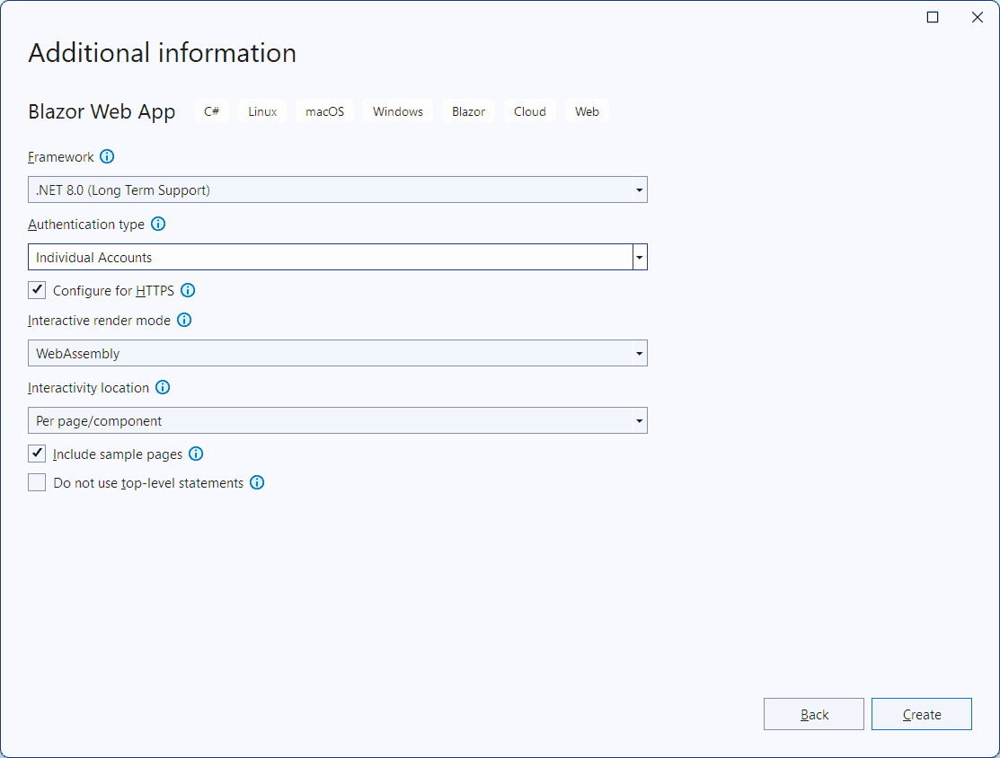

# Demo of one way to let a .NET 8 Blazor page in WebAssembly render mode talk HTTP with the server

This demo is not about a generic HttpClient to connect to whatever third party API, but one specifically connecting back to the app server.

The initial commit in this repository is just a standard Blazor Web App project generated in Visual Studio (or the dotnet command) with WebAssembly as interactive render mode:

The second commit moves the weather page from the server side to the client, but leaves the "calculation" of the weather data on the server side, exposing it as a REST API.

It took me a week to get this working through incomplete discussions such as https://stackoverflow.com/questions/77503849/in-the-new-blazor-web-app-template-using-net-8-how-do-i-make-an-http-request-f.

Observations:
- The server tries to prerender the client page, so you need to provide some HttpClient or face the dreaded error **InvalidOperationException: Cannot provide a value for property 'Http' on type 'BlazorApp1.Client.Pages.Weather'. There is no registered service of type 'System.Net.Http.HttpClient'**.
- If you provide a working HttpClient on the server side, by having in the server's Program.cs `builder.Services.AddScoped(sp => new HttpClient { BaseAddress = new Uri("https://localhost:7242/") })` (not as bad as it looks because the port number here is chosen during project creation and won't change, as far as I know), you indeed get a quick and complete prerendered response from the server. But then the client renders the same page again in WebAssembly, and the output may change (it always changes quite dramatically in this example, because the "forecast" is random). I like the prerendering of the page title and headers, but not of data that may change a few seconds later. Is it worth while fetching the underlying data twice, when the page isn't interactive meanwhile, just to offer a glimpse at some data earlier?
- If instead you provide a generic HttpClient on the server, by having in the server's Program.cs `builder.Services.AddHttpClient()`, then initially you get **InvalidOperationException: An invalid request URI was provided. Either the request URI must be an absolute URI or BaseAddress must be set**. But if you simply don't use the HttpClient in that prerendering case, you get the best result in my book: the scaffolding of the page is prerendered, and the table contents arrive a little later.
- I didn't get it working with prerendering turned off, but I didn't try hard, and now I think it won't be any better anyway.
- Alternatively, instead of injecting a "fake" HttpClient, we can wrap the use of HttpClient in the implementation of a service interface and provide a dummy implementation of that interface on the server side. Branch [using_service](../../tree/using_service) demonstrates that. Not sure the extra code actually helps understandability.